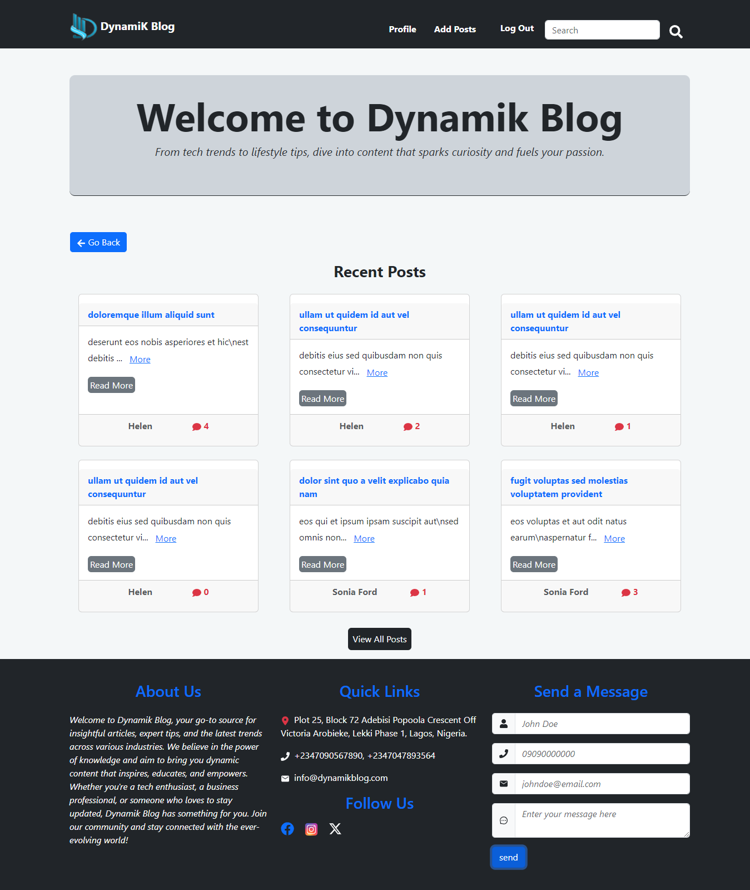

# dynamikBlog



## Project Overview

Dynamik Blog is a dynamic and responsive platform designed for sharing and discovering blog posts. Built with a modern tech stack, including React for the frontend and nodeJs and expressJs for backend api. The blog offers a seamless user experience. Users can browse, search, and engage with a variety of posts on various topics. Whether you're a reader or a contributor, Dynamik Blog provides a welcoming space for insightful content and engaging discussions.

### Built With

- [vite](https://vitejs.dev/guide/)
- Rest Api
- HTML5
- CSS
- Bootstrap css

## Getting Started

To get started with this project, follow the steps below:

### Installation

1. Clone the repository.

   ```sh
   git clone https://github.com/ChinenyeNmoh/dynamikBlog.git
   ```

   cd into the blogApp folder

2. Install the required packages.
   ```sh
   npm install package.json
   ```
3. Configure your .env file with your email and password credentials for sending mails and also the following fields

   ```sh
   PORT=YOUR_PORT
   MONGO_URI=YOUR_MONGO_URI
   BASE_URL =BASE_URL
   HOST=EMAIL_HOST
   SERVICE=EMAIL_SERVICE
   PASS=GOOGLE_APP_PASSWORD
   USER=MAIL_USERNAME

   ```

### Start the application for development.

```sh
npm run dev
```

### preparing for deployment.

```sh
npm run build
```

To learn more about deployment, [see this](https://vitejs.dev/guide/static-deploy.html)

## Author

- Chinenye Nmoh [Github](https://github.com/ChinenyeNmoh/) / [Linkedin](https://www.linkedin.com/in/chinenye-nmoh-88479699/) / [Email](chinenyeumeaku@gmail.com)
